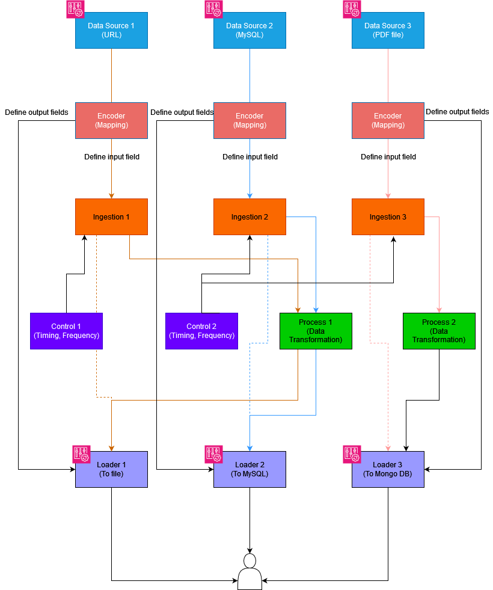

# Python ETL Multithread Custom Process

The provided Python code defines an ETL (Extract, Transform, Load) process in a multi-thread class based infrastructure.

# ETL Class Structure:

The Framework is able to manage different flows of acquisition, trasformation and loading from a DataSource to a final place.
The framework schema follow the figure:



We can see, from the image how the framework works:
1) We have 3 flows (or streams) that start with some data from DataSource, DataSource 2 and DataSource 3.
2) Every DataSource has an Encoder that defines the fields in input (from where? which fields?) and the field in output (to where? which fields?) of the flow
3) The data will be downloaded from the DataSource using the method defined inside the DataSource
4) The data can be transformed as needed
5) The Flow Control System will define when and how often the flow has to be run. The FCS generates a new thread on the python process for each flow, saving CPUs on the waiting time
6) All result data will be saved/uploaded as needed

Ingestions, Trasformations and Loaders are fully customizable. The framework is on development, it provides some predefined, but limited, functionalities but it is possible to unlock all his potential with custom python functions.

## Libraries to import

The main library to be able to use the Framework is:
```python
from ETL.Pipeline import Pipeline
```

To be able to run properly the ETL pipeline we need to implement this list of libraries:

```python
from ETL.Pipeline import Pipeline, FlowConfig
from ETL.modules.DataSource import DataSourceConfig
from ETL.modules.Encoder import EncoderConfig
from ETL.modules.Loader import LoaderConfig
from ETL.modules.Utils import Utils
from datetime import datetime
```

Those libraries will help us to manage easily some configuration in few lines of code.

## DataSource:
Datasource defines which kind of source we are facing on. Right now we identify:
- URL DataSource
- MySQL DataSource
- Custom DataSource
Each of them has his own configuration as follow:

### URL DataSource

This kind of DataSource will use BeautifulSoap4 to be able to screaping content from the website.
Based on the tags defined inside the encoder it will extract all date into a dataframe.
It's suggested for quick data acquisition. More advanced scraping tecniques can be done thanks to the Custom DataSource.
```python
# Datasource Config
url = "https://www.google.com"
ds_config = DataSourceConfig().scraping_source_config(url)
```
This will create a dictionary as follow:
```python
def scraping_source_config(self, url):
    return {
        "source_type": "url",
        "source_response": "plain_text",
        "url": url
    }
```
<b>Note:</b> source_type key is mandatory for each configuration.

### MySQL DataSource

```python
# Datasource Config
ds_config = DataSourceConfig().mysql_source_config("127.0.0.1", "root", "", "mt-engineering", "Select * from wp_postmeta")
```
This will create a dictionary as follow:
```python
def query_source_config(self, host, username, password, database, query):
    return {
        "source_type": "query_mysql",
        "username": username,
        "password": password,
        "database": database,
        "host": host,
        "query": query
    }
```

### Custom DataSource

```python
# Datasource Config
ds_config = DataSourceConfig().custom_source_config()
```
This will create a dictionary as follow:
```python
def custom_source_config(self):
    return {
        "source_type": "custom"
    }
```


## Encoder:

## Ingestion:

## Transformation:

## Loader

## Flow

# Real Case Use